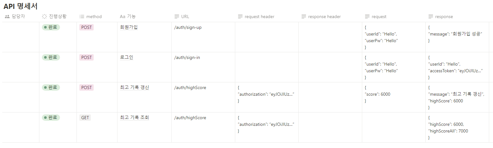
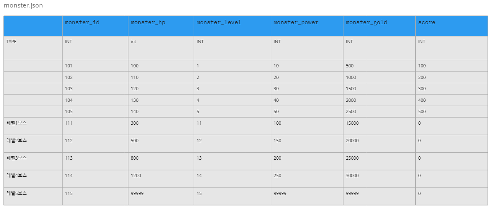
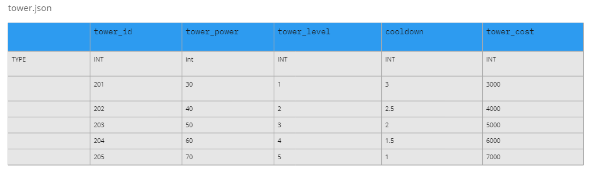
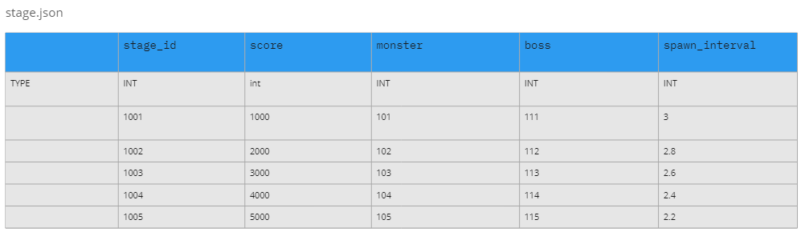
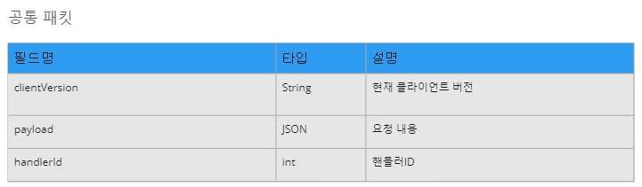
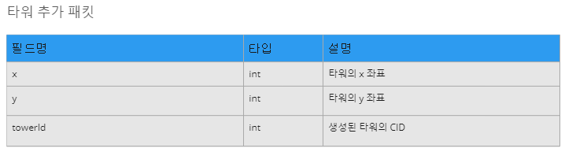
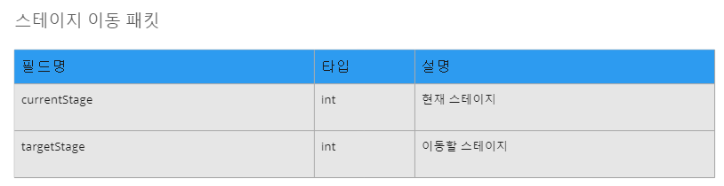
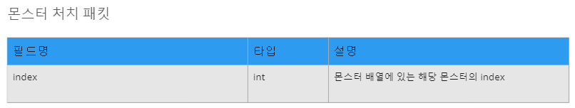
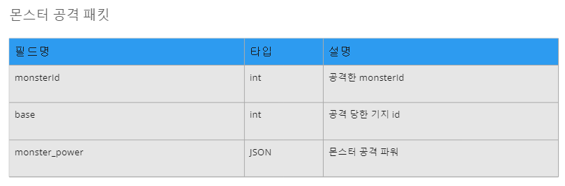
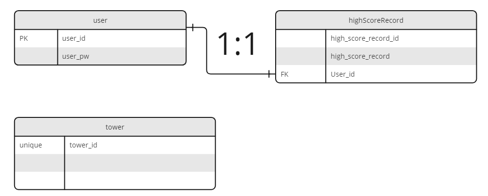

# 타워 디펜스 게임

## 게임 규칙

- 회원가입 / 로그인

  - 회원가입을 한 후 로그인을 해야 게임 플레이 가능
  - 로그인을 한 후 로그아웃 가능
  - 로그인을 하고 10분 후에 로그아웃이 됨
  - '로그인 시간 연장' 버튼을 클릭하여 로그인 시간을 연장할 수 있음

- 게임의 목적

  - 타워를 설치하여 스파르타 기지로 몰려드는 몬스터들을 잡아 기지를 지키는 것

- 게임 오버

  - 스파르타 기지의 HP가 0이 되면 게임 오버가 됨

- 몬스터

  - 몬스터 처치 시 골드 획득
  - 최초의 몬스터 레벨은 1
  - 일정 점수가 될 때마다 몬스터의 레벨이 1씩 증가됨
  - 몬스터의 레벨이 오르면 체력, 공격력, 처치 시 획득할 수 있는 골드가 증가됨

- 스테이지

  - 몬스터의 레벨이 오르면 스테이지가 1씩 증가됨
  - 스테이지가 넘어가며 보스 등장
  - 보스 처치 시 대량의 골드 획득 가능
  - 스테이지가 넘어갈 수록 몬스터의 생성 주기가 짧아짐

- 타워

  - 우측 상단의 '타워 구입' 버튼을 클릭하면 타워가 길 주변에 랜덤으로 배치가 됨
  - 타워는 3000 골드가 있어야 구매 가능
  - 일정 쿨타임마다 가까이에 있는 몬스터에게 데미지를 줌

- 점수

  - 몬스터를 처치할 때마다 일정 점수가 올라감
  - 몬스터의 레벨이 높아지면 처치 시 얻을 수 있는 점수가 늘어남
  - 게임 오버 시 게임 점수가 최고 기록이라면 현재 계정 최고 기록에 표기가 됨
  - 만약 최고 기록이 전체 계정 중 최고 기록이라면 해당 점수와 유저 이름이 기록이 됨

- 일시 정지 / 배속
  - 우측 상단에 있는 일시 정지( || ) 버튼을 누르면 게임이 멈추고 재생( ▶ ) 버튼으로 바뀜
  - 재생 ( ▶ ) 버튼 클릭 시 게임이 다시 시작이 되고 일시 정지( || ) 버튼으로 바뀜
  - 우측 상단의 '1x' 버튼 클릭 시 게임 속도가 빨라지고(2배속) '2x' 버튼으로 바뀜
  - '2x' 버튼 클릭 시 게임 속도가 다시 느려지고(1배속) '1x' 버튼으로 바뀜

## API 명세서
[miro 링크](https://miro.com/app/board/uXjVK7LE7Ns=/)

## 데이터 테이블
[miro 링크](https://miro.com/app/board/uXjVK7LE7Ns=/)

- monster.json

  

- tower.json

  

- stage.json

  

## 패킷 구조 설계
[miro 링크](https://miro.com/app/board/uXjVK7LE7Ns=/)

- 공통 패킷

    

- 타워 추가 패킷

    

- 스테이지 이동 패킷

    

- 몬스터 처치 패킷

    

- 몬스터 공격 패킷

    

## ERD
[miro 링크](https://miro.com/app/board/uXjVK7LE7Ns=/)

